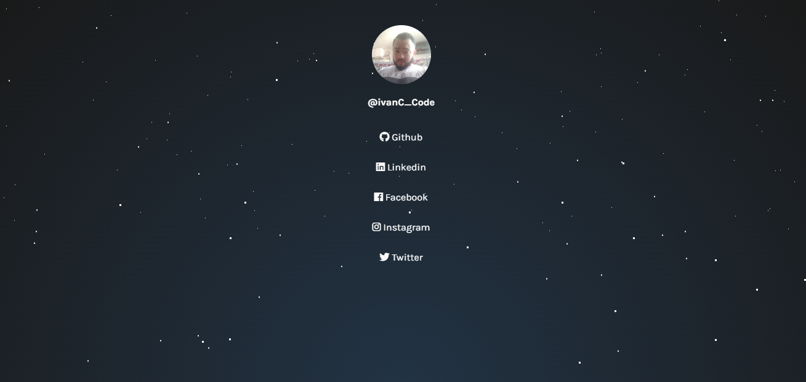

# Linktree

A minimal landing page for your Social Networks and other shared links.

<p align="center">
    <a href="https://www.linkedin.com/in/ivan-da-cruz-787290134/">
        
    </a>
    <a href="https://github.com/ivandacruz/Linktree-ivan/commits/master">
        
    </a>
</p>
<p align="center">
    
</p>


## About the project

- [Demo](https://github.com/ivandacruz/Linktree-ivan)

## Structure

```
Linktree-ivan
├─ index.html
├─ LICENSE
├─ link.png
├─ README.md
└─ style.css

```

---


A Free Linktree Alternative.